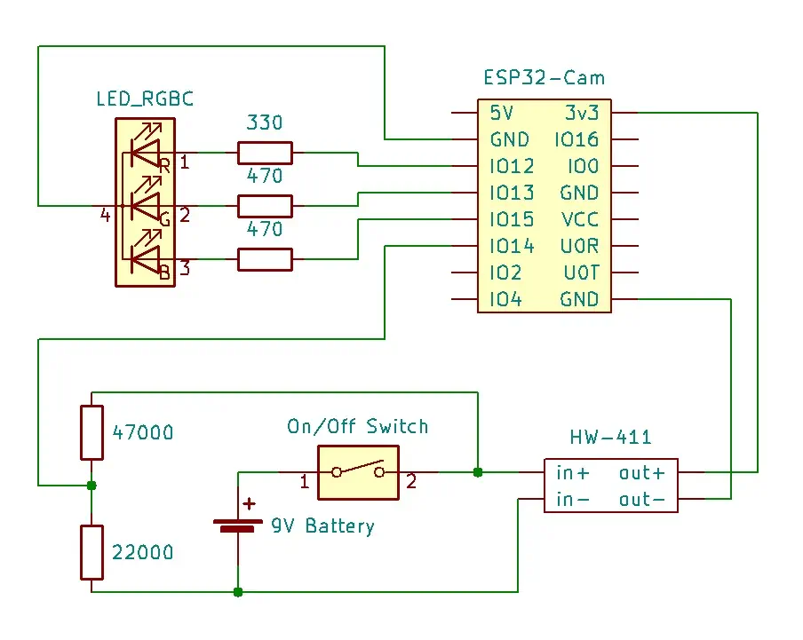

# CBPhotoelectricBarrier
This is the repository for the paper "A Novel Inexpensive Camera-based Photoelectric Barrier System for Accurate Flying Sprint Time Measurement". It shows how the build cost-effective photoelectric barriers based on consumer grade electronic components with an accuracy on par with professional time measurement systems. The repository contains building plans for the devices, software for the microcontroller, and the Android app required for controlling the system and display the time measurements.

<table style="margin-left:auto;margin-right:auto">
    <tr>
        <td>  </td>
        <td>  </td>
    </tr>
</table>

## Building the Photoelectric Barriers
The following image shows the wiring schematics. The upper left part is the RGB-LED that indicates the current status of the barrier (standby, ready, etc.). The lower part shows the power supply including a voltage divider to measure the battery status. 

    

In order to build the photoelectric barriers you will need the depicted modules and connect them according to the schematics by soldering. 
The microcontroller software for the ESP32-Cam module is located under **DeviceDrivers** in this repository. As development environment we used Visual Studio Code and the <a href="https://platformio.org/">PlatformIO</a> plugin. Make sure you install the Espressive32 libraries.
Choose one of the *OpticalBarrier* environments and set in the *main.cpp* under *Barrier.init(CameraID)* the respective Camera ID, which determines the Bluetooth name of the device.

## Android Control App
The Android control app is located in **AndroidApp** and can be build using <a href="https://developer.android.com/studio">AndroidStudio</a>. 

## Acknowledgment 
<table style="margin-left:auto;margin-right:auto;">
    <tr>
        <td></td>
        <td></td>
    </tr>
</table>
This project was originally developed at Chemnitz University of Technology and funded by the Deutsche Forschungsgemeinschaft (DFG, German Research Foundation) – Project-ID 416228727 – CRC 1410.

## How to cite

(Preprint not yet available)

